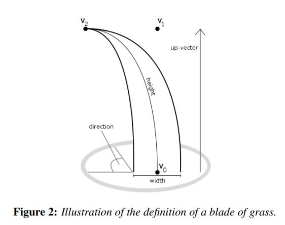
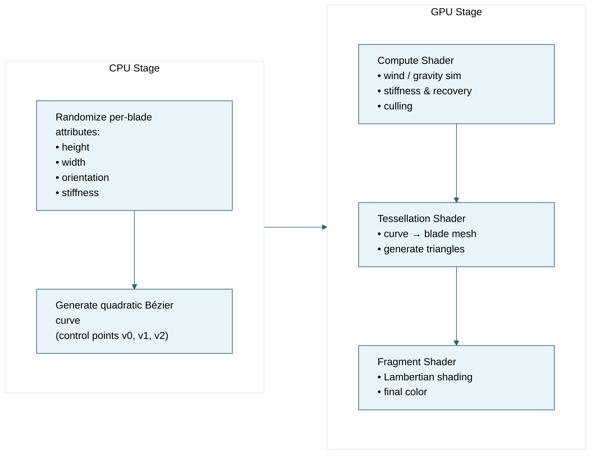
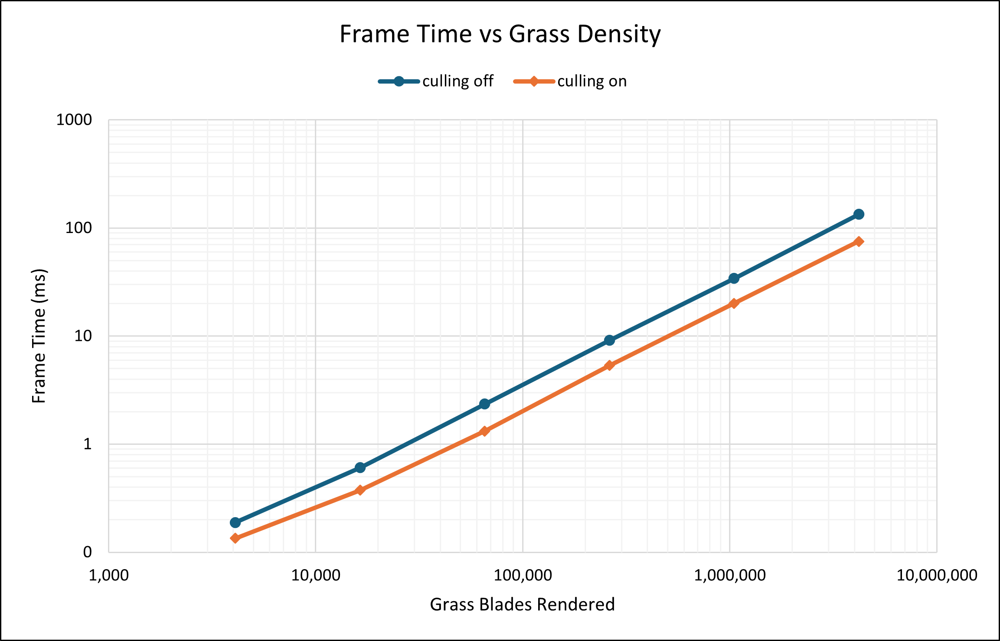

# Vulkan Grass Rendering

## Project Introduction

> University of Pennsylvania — CIS5650: GPU Programming & Architecture  
> Jacky Park  
> Tested on: Windows 11 · i7-14700K @ 3.40 GHz · 64 GB RAM · RTX 5090 (32 GB VRAM)

A real-time renderer that leverages tessellation shaders to generate and draw dense grass geometry based on [Responsive Real-Time Grass Rendering for General 3D Scenes](https://dl.acm.org/doi/10.1145/3023368.3023380) in [Vulkan](https://www.vulkan.org/).

## Features
- **Procedural grass blades**  
  Each blade starts as a quadratic Bézier curve with randomized height, width, orientation, and stiffness for natural variation.

- **Physics-driven animation**  
  A compute shader simulates wind, gravity, and recovery so the grass responds and settles instead of just wobbling on a fixed sine wave.

- **GPU-side culling**  
  Distance, frustum, and orientation culling run in compute to skip blades that won't be visible, saving a lot of work.

- **On-the-fly tessellation**  
  Tessellation shaders turn curves into actual blade geometry at render time, so dense fields can be drawn without pre-storing heavy meshes.

## Showcase 

  

# The Pipeline: From Bezier Curves to Grass Blades

In this renderer, each blade of grass begins as a quadratic Bézier curve (degree 2) generated on the CPU.   

We define three control points **v0, v1, v2** that shape the blade’s bend and silhouette. For each blade, we also randomize **height, width, orientation, and stiffness** to create natural variation.

  

Once those attributes are generated, most of the heavy lifting moves to the GPU:
- A **compute shader** handles simulation (wind, gravity, recovery) and culls blades that shouldn’t be drawn.
- A **tessellation shader** takes the curve description and expands it into actual renderable geometry in real time.
- A **fragment shader** shades the final grass using simple Lambertian lighting.
  

# Performance Analysis
To analyze performance, I used Nsight Graphics GPU capture to record frame time in milliseconds and averaged it over ~5 seconds.  
Tests were run with and without GPU culling for comparison.

| 2^n | Grass Count (blades) | Frame Time (ms), Culling OFF | Frame Time (ms), Culling ON |
|:---:| --------------------:| ---------------------------:| --------------------------:|
| 12  |               4,096  |                      0.189  |                     0.135  |
| 14  |              16,384  |                      0.605  |                     0.375  |
| 16  |              65,536  |                      2.352  |                     1.318  |
| 18  |             262,144  |                      9.122  |                     5.339  |
| 20  |           1,048,576  |                     34.181  |                    20.065  |
| 22  |           4,194,304  |                    133.660  |                    75.295  |

  

If we fit the timing data to a power law of the form  
**time = a · (blades)^b**,  
we get approximate exponents:

- **Culling OFF:** b ≈ 0.960  
- **Culling ON:** b ≈ 0.954  

That matters because **b ≈ 1 would mean perfectly linear scaling** (doubling blade count doubles cost).  
Here, both exponents are just under 1, which means two things:

1. **The renderer scales ~O(n^0.96)** instead of something worse like O(n²). In other words, most of the cost really is per-blade work, and we're not hitting some hidden quadratic bottleneck in the pipeline.

2. **Culling actually scales slightly better at high density.** The culled path has a lower exponent (0.954 vs 0.960), which means as we crank up total blades, the "culling ON" curve grows a bit more slowly than the "culling OFF" curve. The gap between them gets larger at millions of blades.

Why does culling improve scaling instead of just shifting everything down by a constant? Without additional testing, we cannot know for sure, but here are some possible reasons:

- **Culling overhead gets amortized**  
  The compute shader that does distance/frustum/orientation culling has some fixed setup cost to run.  
  At low blade counts, that fixed cost is a noticeable chunk of the frame.  
  At high blade counts, that same cost is basically free compared to the work it prevents.  
  So the payoff per dispatch goes up with scene density.

- **Less memory traffic downstream**  
  After culling, only visible blades get forwarded to tessellation and shading.  
  That means fewer patches to tessellate and fewer fragments to shade, which reduces memory traffic and cache pressure in the later stages of the pipeline.  
  This effect compounds at high grass densities, which is where we’re otherwise most bandwidth-limited.

At ~4.2M blades, this shows up clearly:  
frame time drops from ~134 ms (no culling) to ~75 ms (culling on), which is roughly a **1.8× speedup**. With culling, it truly is:
> “the more grass you render, the more frame time you save!” — *not Jensen Huang*