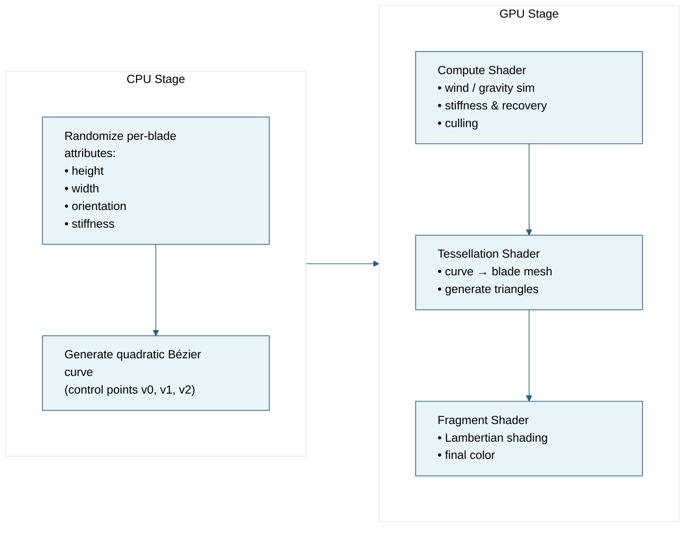

# Vulkan Grass Rendering

## Project Introduction

> University of Pennsylvania — CIS5650: GPU Programming & Architecture  
> Jacky Park  
> Tested on: Windows 11 · i7-14700K @ 3.40 GHz · 64 GB RAM · RTX 5090 (32 GB VRAM)

A real-time Vulkan renderer that uses tessellation shaders to generate and draw dense grass geometry.

  

# The Pipeline: From Bezier Curves to Grass Blades ]

In this renderer, each blade of grass begins as a quadratic Bézier curve (degree 2) generated on the CPU.   

We define three control points **v0, v1, v2** that shape the blade’s bend and silhouette. For each blade, we also randomize **height, width, orientation, and stiffness** to create natural variation.

  

Once those attributes are generated, most of the heavy lifting moves to the GPU:
- A **compute shader** handles simulation (wind, gravity, recovery) and culls blades that shouldn’t be drawn.
- A **tessellation shader** takes the curve description and expands it into actual renderable geometry in real time.
- A **fragment shader** shades the final grass using simple Lambertian lighting.
  

